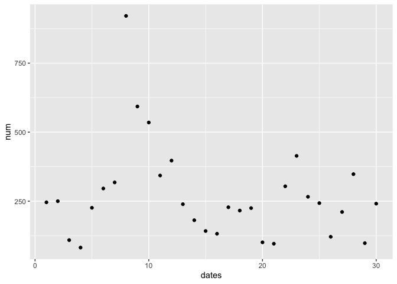

433 HW2
================
Shupeng Tang
2/11/2021

``` r
library(nycflights13)
library(dplyr)
library(tidyverse)
```

``` r
#Question 1
#count number of flights missing departure time
sum(is.na(flights$dep_time))
```

    ## [1] 8255

``` r
flights
```

    ## # A tibble: 336,776 x 19
    ##     year month   day dep_time sched_dep_time dep_delay arr_time sched_arr_time
    ##    <int> <int> <int>    <int>          <int>     <dbl>    <int>          <int>
    ##  1  2013     1     1      517            515         2      830            819
    ##  2  2013     1     1      533            529         4      850            830
    ##  3  2013     1     1      542            540         2      923            850
    ##  4  2013     1     1      544            545        -1     1004           1022
    ##  5  2013     1     1      554            600        -6      812            837
    ##  6  2013     1     1      554            558        -4      740            728
    ##  7  2013     1     1      555            600        -5      913            854
    ##  8  2013     1     1      557            600        -3      709            723
    ##  9  2013     1     1      557            600        -3      838            846
    ## 10  2013     1     1      558            600        -2      753            745
    ## # … with 336,766 more rows, and 11 more variables: arr_delay <dbl>,
    ## #   carrier <chr>, flight <int>, tailnum <chr>, origin <chr>, dest <chr>,
    ## #   air_time <dbl>, distance <dbl>, hour <dbl>, minute <dbl>, time_hour <dttm>

``` r
#for loop that outputs the names of colunms that have missing values
for (i in 1:19) {
 if(sum(is.na(flights[,i])) > 0) {print(colnames(flights[,i]))}
}
```

    ## [1] "dep_time"
    ## [1] "dep_delay"
    ## [1] "arr_time"
    ## [1] "arr_delay"
    ## [1] "tailnum"
    ## [1] "air_time"

**Question 1** There are total of 8225 flights missing dep\_time. Other
missing variables are “dep\_delay”, “arr\_time”, “arr\_delay”,
“tailnum”, “air\_time”. These missing variables might indicate that
the flights are canceled, therefore they don’t have a departure time.

``` r
#Question 2 
df1 = mutate(new_dep_time = (((dep_time)/100)*60 +(dep_time)%%100 ), flights)
df2 = mutate(new_sched_dep_time = ((sched_dep_time)/100)*60 + (sched_dep_time)%%100 , flights)
new_times = data.frame(new_dep_time = df1$new_dep_time, new_sched_dep_time = df2$new_sched_dep_time)
head(new_times)
```

    ##   new_dep_time new_sched_dep_time
    ## 1        327.2              324.0
    ## 2        352.8              346.4
    ## 3        367.2              364.0
    ## 4        370.4              372.0
    ## 5        386.4              360.0
    ## 6        386.4              392.8

``` r
#Question 3
#filter out the flights that have na dep_time and form a new data frame
df = filter(flights, is.na(flights$dep_time))

#for loops that adds number of canceled flights each day to a dataframe containing the date and corresponding canceled numbers
num_per_day = data.frame(dates = 1:30, num = 0)
for (i in 1:30) {
num_per_day$num [i]= (nrow(filter(df, df$day == i)) ) 
}
#scatterplot(num_per_day~dates)
ggplot(aes(x=dates ,y=num), data = num_per_day) + geom_point()
```

<!-- -->

**Question 3**

From the plot above I don’t see a clear pattern for flight cancellation,
but we can see that the numbers canceled flights are unusually high when
there are also large numbers of flights delayed, therefore proportion of
canceled flights and delayed flights should be related.
