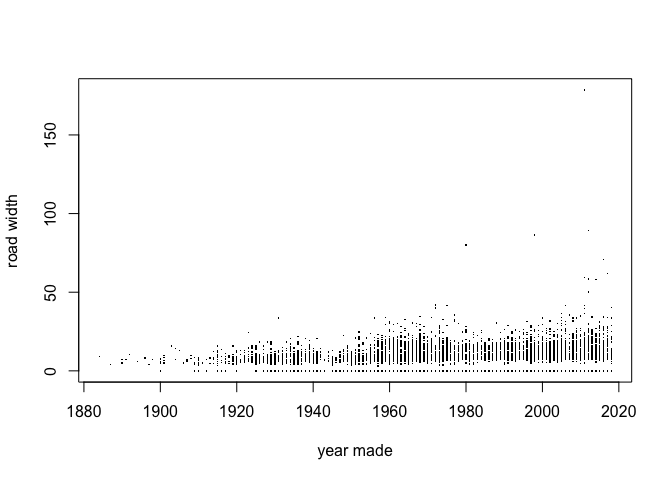

BridgeData
================
Shupeng Tang
2/5/2021

``` r
#read the original bridge data and form a df called rawbridge
rawBridge = read.csv("Bridge data.csv")
#summary(rawBridge)
#assign ID, year, fips, conditions as vecter "keep"
colname = colnames(rawBridge)
colname = colname[58:62]
keep = c("STRUCTURE_NUMBER_008", "YEAR_BUILT_027","STATE_CODE_001", "COUNTY_CODE_003", "PLACE_CODE_004", colname)
#create an df with required columns
bridge=  rawBridge[keep]
#change names of some columns for easier identification
names(bridge)[names(bridge)== "STRUCTURE_NUMBER_008"] = "bridgeID"
names(bridge)[names(bridge)== "YEAR_BUILT_027"] = "year"
names(bridge)[names(bridge)== "COUNTY_CODE_003"] = "county"
names(bridge)[names(bridge)== "PLACE_CODE_004"] = "place"
names(bridge)[names(bridge)== "ROADWAY_WIDTH_MT_051"] = "roadWidth"
names(bridge)[names(bridge)== "STATE_CODE_001"] = "state"
names(bridge)[names(bridge)== "DECK_WIDTH_MT_052"] = "deckWidth"
names(bridge)[names(bridge)== "RIGHT_CURB_MT_050B"] = "Conditions"
names(bridge)[names(bridge)== "VERT_CLR_OVER_MT_053"] = "overMT"
names(bridge)[names(bridge)== "VERT_CLR_UND_REF_054A"] = "underRef"
#Display fisrt twenty rows of bridge data
bridge[1:20,]
```

    ##           bridgeID year state county place Conditions roadWidth deckWidth
    ## 1  00000000000F303 1932    55     51     0        0.2       7.5       7.9
    ## 2  00000000000F304 1974    55     51     0        0.0       3.7       3.7
    ## 3  00000000000F310 1948    55    115     0        0.0       7.0       7.8
    ## 4  00000000000F311 1979    55    115     0        0.0       9.1      10.3
    ## 5  00000000000F315 1977    55      3     0        0.0       8.6      10.5
    ## 6  00000000000F317 1980    55      3 59450        0.0       8.5       9.1
    ## 7  00000000000F318 1980    55      3 59450        0.0       8.5       9.1
    ## 8  00000000000F321 1884    55    115     0        0.0       9.1      10.4
    ## 9  00000000000F323 1999    55      3     0        0.0       7.3       7.9
    ## 10 00000000000F324 2006    55      3     0        0.0       7.3       7.9
    ## 11 00000000000F325 1996    55      3     0        0.0       7.3       7.9
    ## 12 00000000000F326 1996    55     51     0        0.3       7.3       7.9
    ## 13 00000000000F328 1981    55      3     0        0.0       9.1       9.8
    ## 14 00000000000F329 2000    55      7     0        0.0       7.2       7.8
    ## 15 00000000000F330 2003    55    115     0        1.5       9.1      10.2
    ## 16 00000000000F331 2004    55     51     0        0.0       7.3       7.9
    ## 17 00000000000F905 1977    55     78 39250        0.0       7.2       7.4
    ## 18 00000000000F906 1977    55     78     0        0.0       7.3       7.9
    ## 19 00000000000F916 1985    55     78     0        0.5       7.3       8.2
    ## 20 00000000000F917 1981    55     78     0        0.0       7.5       7.5
    ##    overMT underRef
    ## 1   99.99        N
    ## 2   99.99        N
    ## 3   99.99        N
    ## 4   99.90        N
    ## 5   99.90        N
    ## 6   99.99        N
    ## 7   99.99        N
    ## 8   99.90        N
    ## 9   99.99        N
    ## 10  99.99        N
    ## 11  99.00        N
    ## 12  99.00        N
    ## 13  99.00        N
    ## 14  99.99        N
    ## 15  99.99        N
    ## 16  99.90        N
    ## 17  99.99        N
    ## 18  99.99        N
    ## 19  99.90        N
    ## 20  99.90        N

``` r
#make a plot showing roadwidth on the y axis and year of the bridge on x axis
plot(bridge[, 2], bridge[,7], xlab = "year made", ylab = "road width", pch = ".")
```

<!-- -->
